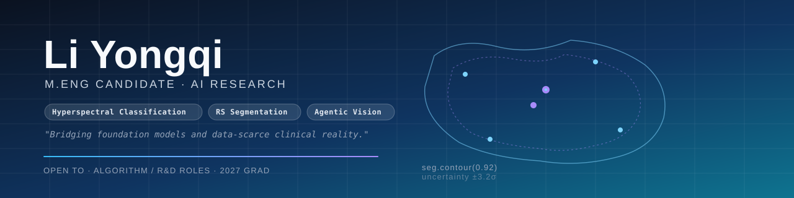

 

 

---

## 👋 About Me

I am **Li Yongqi**, a final-year M.Sc. candidate at **Henan University of Technology**, working on **remote sensing image understanding**. My research lives at the intersection of two concrete threads:

- 🛰️ **Hyperspectral image classification** — exploiting the joint spectral–spatial structure of high-dimensional remote sensing data for robust scene and material recognition under limited labels.
- 🌐 **Remote sensing image segmentation** — building point-supervised / weakly-supervised segmentation frameworks (e.g., hyperbolic-geometry–based uncertainty disentanglement) that learn from cheap annotations without sacrificing boundary precision.

Beyond that, I'm actively exploring **agentic vision** — building models that can perceive, self-prompt, and reason iteratively about visual inputs. My current focus is on interactive segmentation agents built on SAM-family backbones, post-trained with LoRA SFT + GRPO.

- 📄 1 SCI Q1 paper published

---

## 🔬 Research Interests

<table>
  <tr>
    <td width="33%" valign="top">
      <h3>🛰️ Hyperspectral Classification</h3>
      
Exploit the joint spectral–spatial structure of high-dimensional remote sensing data for robust scene and material recognition. Focus on label-efficient regimes (semi-/self-/few-shot) and foundation-model adaptation to multi- and hyperspectral inputs.

      
<code>Spectral-Spatial</code> <code>Self-supervised</code> <code>Cross-scene</code> <code>Foundation Models</code>

    </td>
    <td width="33%" valign="top">
      <h3>🌐 Remote Sensing Segmentation</h3>
      
Point- and weakly-supervised segmentation for SAR, optical, and aerial imagery. Plug-in modules in hyperbolic space to disentangle aleatoric / epistemic uncertainty and tame label ambiguity, with systematic side-by-side comparison to PointSAM, ReSAM, and SAM2.

      
<code>Point-supervised</code> <code>Hyperbolic</code> <code>Uncertainty</code> <code>SAR</code>

    </td>
    <td width="33%" valign="top">
      <h3>🤖 Agentic Vision</h3>
      
Vision agents that perceive, self-prompt, and reason iteratively. Combine SAM-family backbones with LoRA SFT + GRPO post-training (verl framework) to enable interactive, prompt-driven segmentation that converges under few-shot user feedback.

      
<code>SAM</code> <code>LoRA</code> <code>GRPO</code> <code>verl</code> <code>vLLM</code>

    </td>
  </tr>
</table>

---

## 📚 Publications

| Year | Venue | Title | Status |
| :--- | :---- | :---- | :----- |
| 2026 | **Information Sciences** (SCI Q1) | Jointly detecting humor and sarcasm with fuzzy emotion knowledge fusion from graph learning perspective | ✅ Published |

---

## 🚀 Selected Projects

_To be added._

---

## 🛠 Tech Stack

<table>
  <tr><td width="110"><b>Languages</b></td><td><code>Python</code> <code>C/C++</code> <code>MATLAB</code> <code>SQL</code></td></tr>
  <tr><td><b>Deep Learning</b></td><td><code>PyTorch</code> <code>timm</code> <code>Transformers</code> <code>PEFT / LoRA</code> <code>MMSegmentation</code></td></tr>
  <tr><td><b>Foundation Models</b></td><td><code>SAM / SAM2</code> <code>Qwen-VL</code> <code>CLIP</code> <code>Mamba / SSM</code></td></tr>
  <tr><td><b>RL &amp; Agents</b></td><td><code>verl</code> <code>GRPO</code> <code>vLLM</code> <code>TRL</code> <code>DeepSpeed</code></td></tr>
  <tr><td><b>Geo / RS</b></td><td><code>GDAL / Rasterio</code> <code>GeoTIFF</code> <code>QGIS</code></td></tr>
  <tr><td><b>Engineering</b></td><td><code>Linux</code> <code>Docker</code> <code>Git</code> <code>Slurm / K8s</code> <code>WandB</code></td></tr>
  <tr><td><b>Data</b></td><td><code>NWPU VHR-10</code> <code>HRSID</code> <code>WHU</code> <code>Indian Pines</code> <code>Houston 2018</code></td></tr>
</table>

---

## 📊 GitHub Stats

  
  

### 🐍 Contribution Snake

  <picture>
    <source media="(prefers-color-scheme: dark)" srcset="https://raw.githubusercontent.com/qi-fg/qi-fg/output/github-snake-dark.svg"/>
    <source media="(prefers-color-scheme: light)" srcset="https://raw.githubusercontent.com/qi-fg/qi-fg/output/github-snake.svg"/>
    
  </picture>

---

## 🏆 Honors & Extras

_To be added._

---

## 📫 Get in Touch

  

📮 最方便的联系方式是邮件或 GitHub Discussions，看到就回。

 

  ⭐ 如果你也在做 <b>遥感视觉 / Agentic Vision / SAM 后训练</b>，欢迎来找我聊，一起做点有意思的东西。

<!--
===========================================================
  发布前需要替换的占位符：
  1. YOUR_EMAIL     -> 你的邮箱（mailto 链接，不填就删掉这一行徽章）
  2. Selected Projects / Honors & Extras 当前显示 _To be added._，
     后续要把对应 `
` 折叠卡或 bullet 写进去
  3. Publications 表格中其他两行（EAAI / TGRS）和专利条目已暂时移除，
     后续要加直接复制 Information Sciences 那行的格式即可
===========================================================
-->